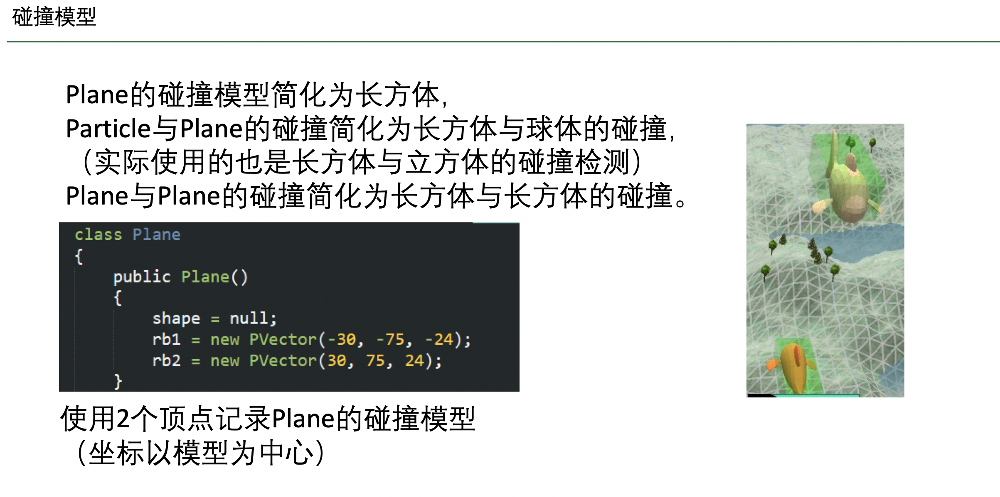
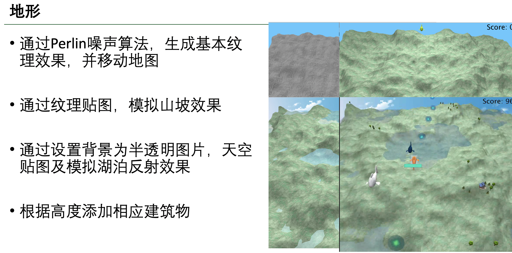

# Overview

This is a computer graphic project for homework, done by a teamwork.
As a flight shooting mini-game, it's built on Java-based `Processing`
platform and should run on Windows (better performance with discrete graphic card, Nvidia prefer😏️).

If you find any bugs, just open an issue.

For profit bussiness, please contact me as the copyright of these code
also belongs to my teammates.

这是一个组队完成的计算机图形学项目。

# How to play

注：运行本程序需要安装java 8或以上版本的java. 建议使用独立显卡运行。

上下左右控制水平移动，Shift升高，Ctrl下降。
空格射击。
P暂停或继续。
回车在游戏结束时的重新开始。

初始血量为5，被敌人攻击后血量-1，并有数秒硬直时间。
血量为0则失败。

分数达到一定值后出现boss，boss有一定血量，击败boss后胜利。

# Screenshot

# Implementation details

